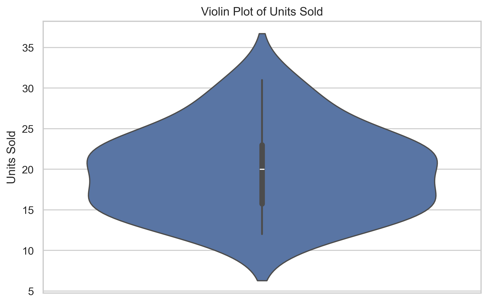
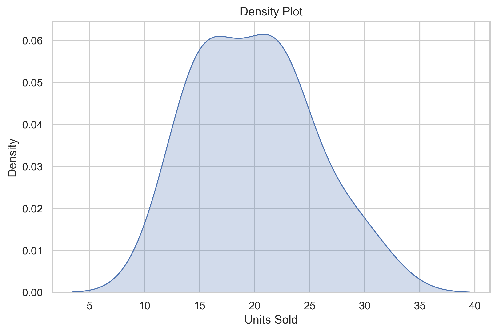
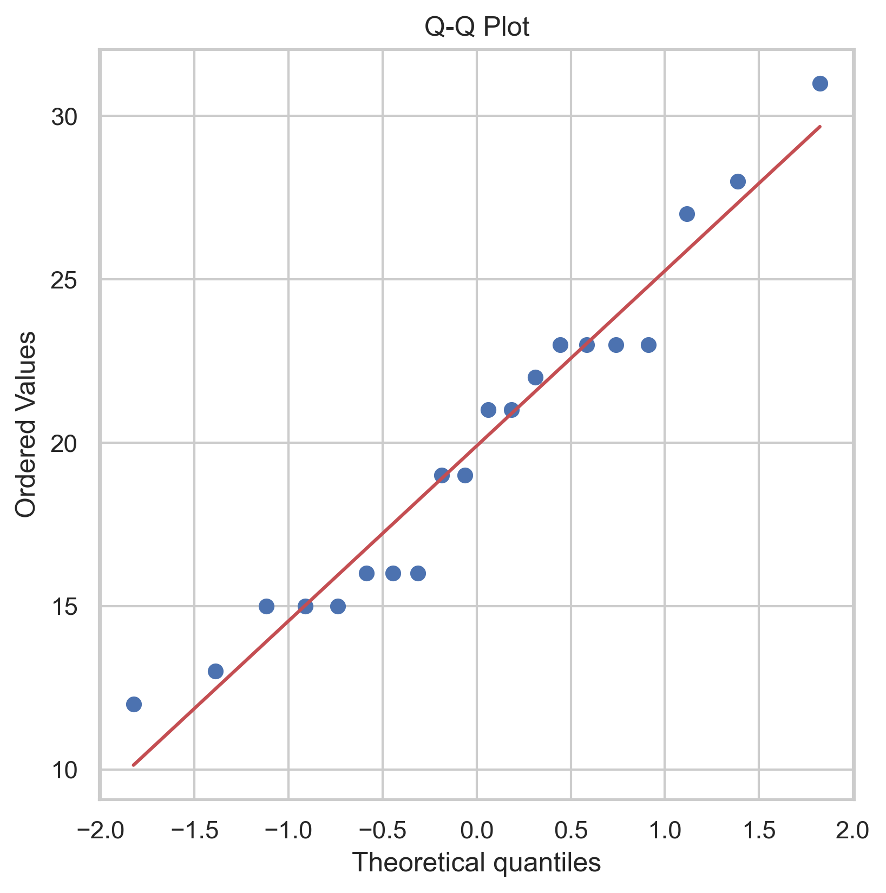
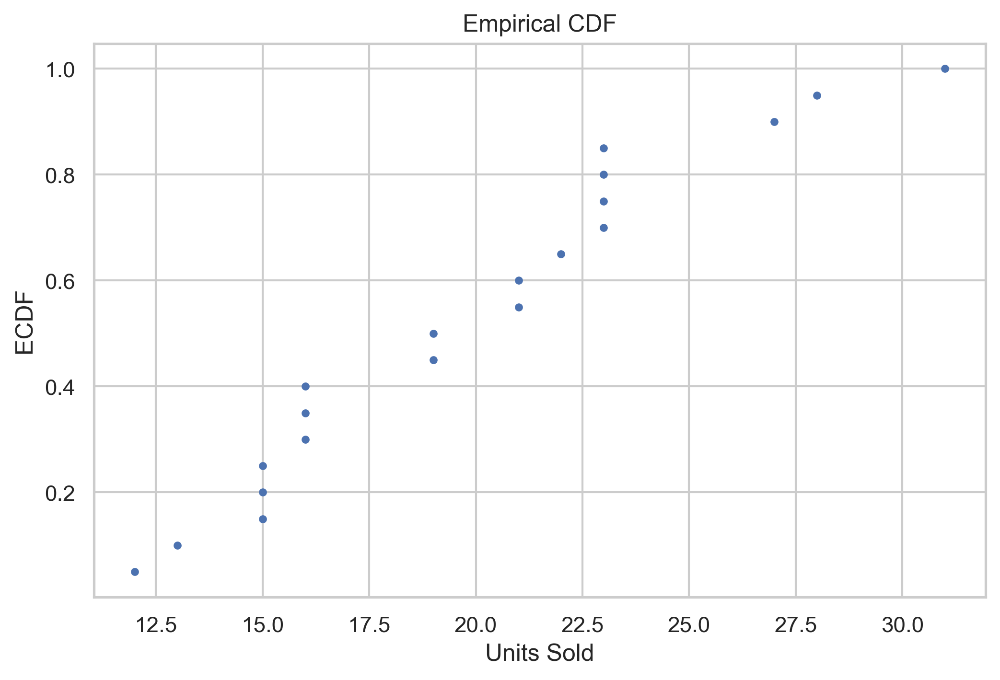

# 📊 Statistics for Data Science

A comprehensive collection of statistical concepts, probability, hypothesis testing, and data analysis techniques essential for Data Science and Machine Learning using Python.

---

## 📌 Overview

Statistics is the backbone of Data Science. This repository contains well-organized Jupyter notebooks covering fundamental and advanced statistical concepts with practical Python implementations and real-world examples.

The objective of this repository is to build a strong statistical foundation required for Data Analysis, Machine Learning, and Artificial Intelligence.

---

## 🎯 Topics Covered

### Descriptive Statistics
- Mean
- Median
- Mode
- Range
- Variance
- Standard Deviation
- Quartiles
- Percentiles
- Skewness
- Kurtosis

### Probability
- Basic Probability
- Conditional Probability
- Bayes' Theorem
- Probability Distributions

### Sampling
- Population vs Sample
- Sampling Techniques
- Sampling Distribution
- Central Limit Theorem

### Inferential Statistics
- Confidence Intervals
- Margin of Error
- Standard Error

### Hypothesis Testing
- Null & Alternative Hypothesis
- p-value
- Significance Level
- One-tailed & Two-tailed Tests

### Statistical Tests
- Z-Test
- T-Test
- Chi-Square Test
- ANOVA

### Correlation & Covariance
- Pearson Correlation
- Spearman Correlation
- Covariance

---

## 🛠️ Technologies Used

- Python
- NumPy
- Pandas
- SciPy
- Matplotlib
- Seaborn
- Jupyter Notebook

---

# 📊 Statistical Visualizations

<table>
<tr>
<td align="center">
<b>Histogram</b><br>

</td>

<td align="center">
<b>Box Plot</b><br>

</td>
</tr>

<tr>
<td align="center">
<b>Bar Chart</b><br>

</td>

<td align="center">
<b>Violin Plot</b><br>

</td>
</tr>

<tr>
<td align="center">
<b>Density Plot</b><br>

</td>

<td align="center">
<b>Q-Q Plot</b><br>

</td>
</tr>

<tr>
<td align="center">
<b>ECDF</b><br>

</td>

<td align="center">
<b>Swarm Plot</b><br>

</td>
</tr>
</table>

```


## 📂 Repository Structure

```
Statistics-for-Data-Science
│
├── dataset/
├── notebooks/
├── images/
├── README.md
├── requirements.txt
├── LICENSE
└── .gitignore
```

---

## 📈 Repository Highlights

- Well-structured notes
- Practical Python implementations
- Visual explanations using graphs
- Hands-on statistical analysis
- Real-world datasets
- Beginner-friendly notebooks

---

## 🚀 Who is this repository for?

- Data Science Beginners
- Machine Learning Enthusiasts
- Students
- Python Developers
- Anyone learning Statistics for Data Science

---

## 📚 Learning Outcome

By completing this repository, you will gain a strong understanding of statistical concepts that are widely used in:

- Data Analysis
- Machine Learning
- Predictive Modeling
- Data Visualization
- Artificial Intelligence

---

## 👨‍💻 Author

**Akash Salunkhe**

Aspiring Data Scientist passionate about solving real-world problems using Data Science, Machine Learning, and Artificial Intelligence.

---

## ⭐ Support

If you find this repository useful, consider giving it a ⭐ to support the project.
